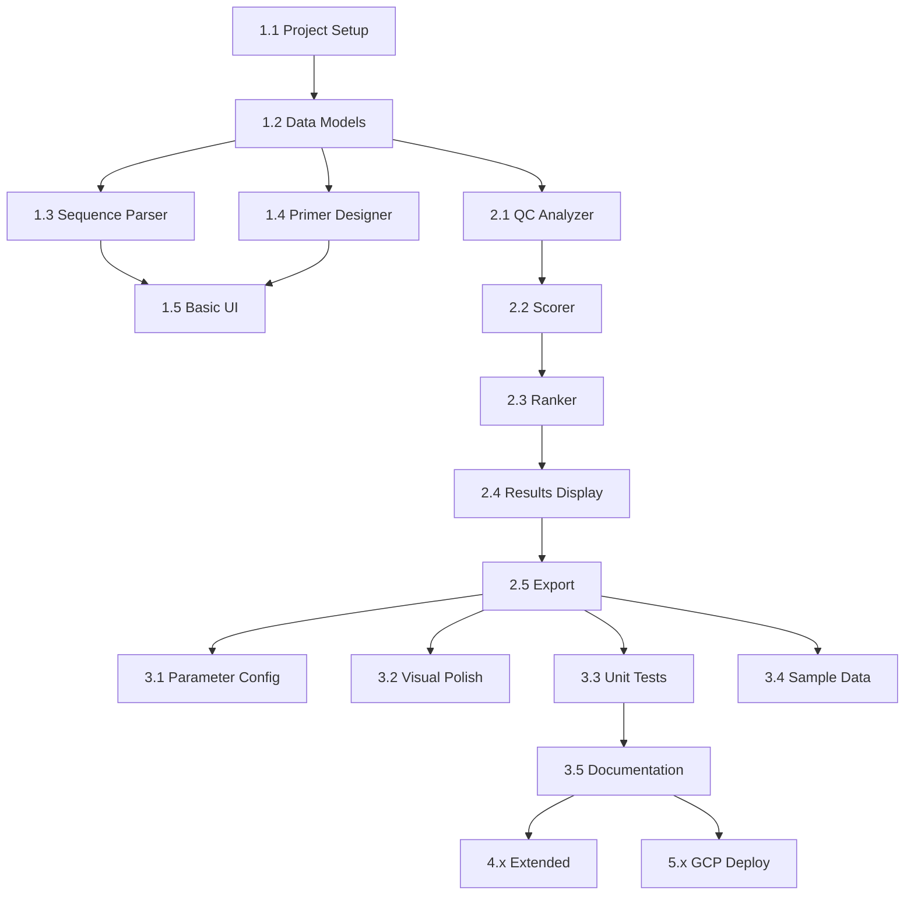

# Development Progress

## Primer Design Automation Pipeline

**Status:** In Progress (Phases 1-2 Complete)
**Target:** Demo-ready in 2-3 days
**Last Updated:** 2025-12-31

---

## Quick Reference

| Phase | Description | Status | ETA |
|-------|-------------|--------|-----|
| Phase 1 | Foundation | ✅ Complete | Day 1 |
| Phase 2 | Core Features | ✅ Complete | Day 2 |
| Phase 3 | Polish | 🔄 In Progress | Day 3 |
| Phase 4 | Extended (Optional) | ⬜ Pending | If time |
| Phase 5 | GCP Deployment (Optional) | ⬜ Pending | If time |

---

## Phase 1: Foundation (Day 1) ✅

### 1.1 Project Setup
- [x] **1.1.1** Create project directory structure
  ```
  primer-design-automation/
  ├── app.py
  ├── requirements.txt
  ├── .gitignore
  ├── src/
  ├── config/
  ├── data/sample_sequences/
  ├── tests/
  └── docs/
  ```
- [x] **1.1.2** Create requirements.txt with dependencies
  - streamlit, primer3-py, biopython, pandas, plotly, pytest, pyyaml
- [x] **1.1.3** Create virtual environment and install dependencies
- [x] **1.1.4** Create `src/__init__.py`
- [x] **1.1.5** Initialize git repository

### 1.2 Data Models (`src/models.py`) ✅
- [x] **1.2.1** Define `QCStatus` enum (PASS, WARN, FAIL)
- [x] **1.2.2** Define `Primer` dataclass
  - sequence, start, end, length, tm, gc_percent
  - hairpin_dg, self_dimer_dg, three_prime_base
  - tm_status, gc_status properties
- [x] **1.2.3** Define `PrimerPair` dataclass
  - forward, reverse, product_size, tm_difference
  - cross_dimer_dg, composite_score, rank
- [x] **1.2.4** Define `QCThresholds` dataclass
  - Tm, GC, length, ΔG thresholds
- [x] **1.2.5** Define `DesignResult` dataclass
  - target_name, target_sequence, primer_pairs

### 1.3 Sequence Parser (`src/sequence_parser.py`) ✅
- [x] **1.3.1** Implement `parse_fasta(file_or_text)` function
  - Accept file upload or pasted text
  - Use Biopython SeqIO
- [x] **1.3.2** Implement `validate_sequence(seq)` function
  - Check for valid nucleotides (A, T, G, C, N)
  - Return (is_valid, error_message)
- [x] **1.3.3** Implement `get_sequence_stats(seq)` function
  - Calculate length, GC%, base composition

### 1.4 Primer Designer (`src/primer_designer.py`) ✅
- [x] **1.4.1** Define `PRIMER3_SETTINGS` defaults
  - Size, Tm, GC ranges, product size
- [x] **1.4.2** Implement `design_primers(sequence, settings)` function
  - Configure primer3 parameters
  - Call primer3.bindings.design_primers
  - Parse results into PrimerPair objects
- [x] **1.4.3** Handle edge cases
  - Sequence too short
  - No primers found
  - Primer3 errors

### 1.5 Basic Streamlit UI ✅
- [x] **1.5.1** Create `app.py` with page config
  - Title, page icon, layout
- [x] **1.5.2** Add sidebar: FASTA file upload
- [x] **1.5.3** Add sidebar: Raw sequence text input
- [x] **1.5.4** Display sequence info after input
  - Name, length, GC%, validation status
- [x] **1.5.5** Add "Design Primers" button

### 1.6 Phase 1 Verification
- [ ] **1.6.1** Can upload FASTA file and see sequence stats
- [ ] **1.6.2** Can paste sequence and see validation
- [ ] **1.6.3** Primer3 successfully generates candidates
- [ ] **1.6.4** All imports work, no runtime errors

---

## Phase 2: Core Features (Day 2) ✅

### 2.1 QC Analyzer (`src/qc_analyzer.py`) ✅
- [x] **2.1.1** Implement `calculate_tm(sequence)` function
  - Use primer3 nearest-neighbor calculation
- [x] **2.1.2** Implement `calculate_gc(sequence)` function
  - (G + C) / length * 100
- [x] **2.1.3** Implement `calculate_hairpin_dg(sequence)` function
  - Use primer3 thermodynamic analysis
- [x] **2.1.4** Implement `calculate_self_dimer_dg(sequence)` function
  - Self-complementarity check
- [x] **2.1.5** Implement `calculate_cross_dimer_dg(seq1, seq2)` function
  - Primer pair complementarity
- [x] **2.1.6** Implement `analyze_primer(primer)` function
  - Populate all QC fields
- [x] **2.1.7** Implement `analyze_pair(pair)` function
  - Calculate cross-dimer, tm_difference

### 2.2 Scorer (`src/scorer.py`) ✅
- [x] **2.2.1** Implement `calculate_tm_score(pair, thresholds)` - 25 pts
  - Optimal Tm distance, Tm difference penalty
- [x] **2.2.2** Implement `calculate_gc_score(pair, thresholds)` - 15 pts
  - Distance from 50% optimal
- [x] **2.2.3** Implement `calculate_structure_score(pair, thresholds)` - 30 pts
  - Hairpin, self-dimer, cross-dimer penalties
- [x] **2.2.4** Implement `calculate_3prime_score(pair, thresholds)` - 20 pts
  - Preferred/avoid 3' end bases
- [x] **2.2.5** Implement `calculate_product_score(pair, thresholds)` - 10 pts
  - Distance from optimal product size
- [x] **2.2.6** Implement `calculate_composite_score(pair, thresholds)` function
  - Combine all sub-scores (0-100)

### 2.3 Ranker (in `src/scorer.py`) ✅
- [x] **2.3.1** Implement `rank_pairs(pairs)` function
  - Sort by composite_score descending
  - Assign rank (1, 2, 3, ...)
- [x] **2.3.2** Implement `filter_pairs(pairs, min_score)` function
  - Remove pairs below threshold

### 2.4 Results Display (Streamlit) ✅
- [x] **2.4.1** Wire up "Design Primers" button
  - Call design_primers → analyze → score → rank
- [x] **2.4.2** Display results table
  - Rank, Score, Fwd Tm, Rev Tm, Product Size
  - Color-coded status indicators
- [x] **2.4.3** Add row selection for detail view
- [x] **2.4.4** Display selected pair details
  - Forward/Reverse sequences
  - Full QC breakdown with status icons

### 2.5 Export Functionality (`src/exporter.py`) ✅
- [x] **2.5.1** Implement `export_csv(results, filepath)` function
  - Flatten primer pairs to rows
- [x] **2.5.2** Implement `to_dataframe(results)` helper
  - Convert DesignResult to pandas DataFrame
- [x] **2.5.3** Add "Export CSV" button to UI
  - Use st.download_button

### 2.6 Phase 2 Verification
- [ ] **2.6.1** End-to-end flow works: input → design → display
- [ ] **2.6.2** Scoring produces sensible rankings
- [ ] **2.6.3** CSV export contains all relevant data
- [ ] **2.6.4** Color coding correctly reflects status

---

## Phase 3: Polish (Day 3) 🔄

### 3.1 Parameter Configuration UI ✅
- [x] **3.1.1** Add Tm range sliders (min, optimal, max)
- [x] **3.1.2** Add GC% range sliders
- [x] **3.1.3** Add product size range input
- [x] **3.1.4** Add number of results slider (1-20)
- [x] **3.1.5** Add "Reset to Defaults" button
- [x] **3.1.6** Wire parameters to Primer3 settings

### 3.2 Visual Design Improvements ✅
- [x] **3.2.1** Add header with logo/title
- [x] **3.2.2** Improve spacing and layout
- [x] **3.2.3** Add loading spinner during computation
- [x] **3.2.4** Add info tooltips for QC metrics
- [x] **3.2.5** Add error handling with user-friendly messages

### 3.3 Unit Tests (`tests/`) ✅
- [x] **3.3.1** Create `test_sequence_parser.py`
  - Test valid FASTA parsing
  - Test invalid nucleotide detection
- [x] **3.3.2** Create `test_primer_designer.py`
  - Test primer generation on known sequence
  - Test edge cases (too short, no results)
- [x] **3.3.3** Create `test_qc_analyzer.py`
  - Test Tm calculation (compare to known values)
  - Test GC calculation
  - Test ΔG calculations
- [x] **3.3.4** Create `test_scorer.py`
  - Test perfect primer pair → high score
  - Test problematic pair → low score
- [x] **3.3.5** Run all tests, ensure passing (87 tests)

### 3.4 Sample Data ✅
- [x] **3.4.1** Create `data/sample_sequences/sars_cov2_spike.fasta`
- [x] **3.4.2** Create `data/sample_sequences/hiv_pol.fasta`
- [x] **3.4.3** Validate samples work end-to-end (scripts/validate_samples.py)

### 3.5 Documentation ✅
- [x] **3.5.1** Update README.md with:
  - Project description
  - Installation instructions
  - Usage guide
  - Screenshots
- [x] **3.5.2** Add inline code comments where needed
- [x] **3.5.3** Document configuration options

### 3.6 Default Config (`config/defaults.yaml`) ✅
- [x] **3.6.1** Create defaults.yaml with all thresholds
- [x] **3.6.2** Load config on app startup

### 3.7 Phase 3 Verification
- [x] **3.7.1** All unit tests pass (87 tests)
- [x] **3.7.2** Sample sequences produce expected results
- [x] **3.7.3** UI is polished and professional
- [x] **3.7.4** README is complete and accurate
- [x] **3.7.5** App is demo-ready

---

## Phase 4: Extended Features (Optional)

### 4.1 TaqMan Probe Design
- [x] **4.1.1** Define `Probe` dataclass in models.py
- [ ] **4.1.2** Implement probe candidate generation
  - Position between forward and reverse primers
  - Tm 8-10°C higher than primers
- [ ] **4.1.3** Implement 5' base check (avoid G)
- [ ] **4.1.4** Add probe to UI display

### 4.2 Batch Processing ✅
- [x] **4.2.1** Accept multi-sequence FASTA
- [x] **4.2.2** Process sequences in loop
- [x] **4.2.3** Aggregate results
- [x] **4.2.4** Batch export to single CSV

### 4.3 Additional Visualizations
- [ ] **4.3.1** Add Tm distribution plot
- [ ] **4.3.2** Add primer position visualization on target
- [ ] **4.3.3** Add score breakdown chart

---

## Phase 5: GCP Cloud Deployment (Optional)

### 5.1 Docker Setup
- [ ] **5.1.1** Create Dockerfile
- [ ] **5.1.2** Create .dockerignore
- [ ] **5.1.3** Test local Docker build
- [ ] **5.1.4** Test local Docker run

### 5.2 GCP Configuration
- [ ] **5.2.1** Create GCP project (or use existing)
- [ ] **5.2.2** Enable required APIs
  - Container Registry
  - Cloud Run
  - Cloud Build
- [ ] **5.2.3** Configure gcloud CLI

### 5.3 Deploy to Cloud Run
- [ ] **5.3.1** Build and push image to GCR
  ```bash
  gcloud builds submit --tag gcr.io/PROJECT_ID/primer-design
  ```
- [ ] **5.3.2** Deploy to Cloud Run
  ```bash
  gcloud run deploy primer-design --image gcr.io/PROJECT_ID/primer-design --region asia-southeast1
  ```
- [ ] **5.3.3** Verify deployment URL works

### 5.4 CI/CD (Optional)
- [ ] **5.4.1** Create cloudbuild.yaml
- [ ] **5.4.2** Connect GitHub repo to Cloud Build
- [ ] **5.4.3** Test automatic deployment on push

### 5.5 Phase 5 Verification
- [ ] **5.5.1** App accessible via Cloud Run URL
- [ ] **5.5.2** All features work in cloud environment
- [ ] **5.5.3** Cold start time acceptable (< 30s)

---

## Dependencies



---

## Completion Criteria

### MVP (Phases 1-3)
- [x] User can upload FASTA or paste sequence
- [x] App generates primer pair candidates
- [x] Primers are QC-checked and scored
- [x] Results displayed in ranked table
- [x] User can see detailed QC breakdown
- [x] User can export results to CSV
- [x] Unit tests pass (87 tests)
- [x] Demo-ready for technical interview

### Extended (Phases 4-5)
- [ ] TaqMan probe design works
- [ ] Batch processing available
- [ ] App deployed to GCP Cloud Run
- [ ] CI/CD pipeline configured

---

## Notes

- **Priority**: Complete Phases 1-3 first (MVP)
- **Time estimate**: ~2-3 focused days for MVP
- **Testing**: Test after each sub-task, not just at phase end
- **Commit strategy**: Commit after each major task (1.x, 2.x, etc.)

---

## Development Guidelines

### Frontend Design (Use Opus 4.5 Model)
Use the `frontend-design` skill with **Opus 4.5 model** for all UI-related tasks:
- Phase 1.5: Basic Streamlit UI ✅
- Phase 2.4: Results Display ✅
- Phase 3.1: Parameter Configuration UI ✅
- Phase 3.2: Visual Design Improvements ✅

**Invoke:** Task tool with `subagent_type="frontend-developer"` and `model="opus"`

This ensures polished, production-grade UI that avoids generic aesthetics.

---

## Next Steps

1. **Run app and verify** - `streamlit run app.py`
2. **Test with sample sequences** - Upload SARS-CoV-2 or HIV FASTA
3. **Write unit tests** - Phase 3.3
4. **Initialize git repo** - Task 1.1.5
