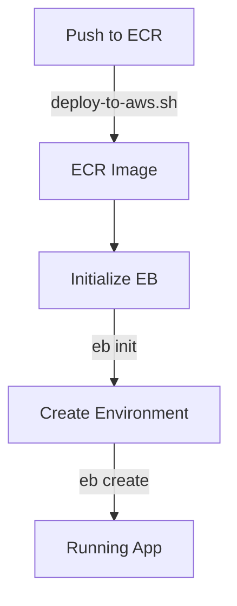

# AWS Deployment Files Guide

This document organizes all AWS-related files and explains their purpose.

---

## 📁 File Organization

### ✅ Working Deployment (Elastic Beanstalk)

| File | Purpose | Status |
|------|---------|--------|
| **AWS_DEPLOYMENT.md** | Complete EB deployment guide | ✅ Primary Guide |
| **Dockerrun.aws.json** | EB container configuration | ✅ Used by EB |
| **.ebignore** | Files excluded from EB deployment | ✅ Active |
| **.elasticbeanstalk/** | EB CLI configuration (auto-generated) | ✅ Active |

### 🔧 Shared Infrastructure Files

| File | Purpose | Status |
|------|---------|--------|
| **Dockerfile** | Container definition | ✅ Used by all deployments |
| **.dockerignore** | Docker build optimization | ✅ Active |
| **deploy-to-aws.sh** | ECR push automation | ✅ Working |
| **requirements.txt** | Python dependencies | ✅ Active |

### ⚠️ Reference Only (Not Currently Used)

| File | Purpose | Status |
|------|---------|--------|
| **create-apprunner-service.sh** | App Runner automation (attempted) | ⚠️ Not compatible with Streamlit |
| **cleanup-aws.sh** | App Runner cleanup script | ⚠️ Not needed |
| **buildspec.yml** | CodeBuild CI/CD config | ⚠️ Future use |

### 📖 Documentation

| File | Purpose | Status |
|------|---------|--------|
| **DEPLOYMENT_SCRIPTS.md** | Script documentation | ✅ Updated |
| **DEV_PROGRESS.md** | Development tracking | ✅ Updated |
| **README.md** | Project overview | ✅ Updated |

---

## 🚀 Quick Reference

### Current Deployment

**Service:** AWS Elastic Beanstalk
**Live URL:** http://primer-design-env.eba-ak2qz6v5.ap-southeast-1.elasticbeanstalk.com
**Instance:** t2.micro (FREE tier)
**Region:** ap-southeast-1 (Singapore)
**Status:** ✅ RUNNING

### Key Commands

```bash
# Deploy
./deploy-to-aws.sh                        # Push to ECR
eb init -p docker -r ap-southeast-1 primer-design
eb create primer-design-env --instance-type t2.micro

# Manage
eb status                                 # Check status
eb logs                                   # View logs
eb open                                   # Open in browser

# Cleanup
eb terminate primer-design-env            # Delete environment
```

---

## 📋 File Details

### AWS_DEPLOYMENT.md ⭐

**Purpose:** Complete step-by-step Elastic Beanstalk deployment guide
**Use:** Primary deployment documentation
**Contains:**
- Prerequisites and installation
- Complete deployment steps
- Instance type recommendations (t2.micro free tier)
- Configuration files explanation
- Cost analysis and optimization
- Troubleshooting guide
- Interview talking points
- App Runner compatibility notes (why it doesn't work)

**When to use:** When deploying to AWS or preparing for interview

---

### Dockerrun.aws.json

**Purpose:** Tells Elastic Beanstalk how to run the Docker container
**Location:** Project root (required)
**Format:** JSON

```json
{
  "AWSEBDockerrunVersion": "1",
  "Image": {
    "Name": "377133361984.dkr.ecr.ap-southeast-1.amazonaws.com/primer-design:latest",
    "Update": "true"
  },
  "Ports": [
    {
      "ContainerPort": 8080,
      "HostPort": 8080
    }
  ]
}
```

**Key fields:**
- `Image.Name`: ECR image URI (auto-pulls from ECR)
- `ContainerPort`: App listens on 8080
- `HostPort`: Load balancer forwards to 8080

**When to update:** When changing ECR repository or container configuration

---

### .ebignore

**Purpose:** Excludes files from EB deployment package
**Location:** Project root
**Similar to:** .gitignore

**Excludes:**
- Git files (.git, .gitignore)
- Python cache (__pycache__, *.pyc)
- Virtual environments (venv/)
- Tests (tests/)
- Documentation (*.md, docs/)

**Why:** Reduces deployment package size, speeds up deployments

---

### Dockerfile ⭐

**Purpose:** Defines Docker container
**Location:** Project root (REQUIRED location)
**Used by:** All Docker-based deployments

**Key features:**
- Base: python:3.11-slim
- Non-root user (appuser)
- Multi-layer optimization
- Health check endpoint
- Port 8080 exposed

**Best practices:**
- Security: Non-root user
- Optimization: Requirements cached separately
- Monitoring: HEALTHCHECK configured

**Cannot be moved** (Docker build context requires it at root)

---

### .dockerignore

**Purpose:** Excludes files from Docker build context
**Location:** Project root (must be with Dockerfile)
**Similar to:** .gitignore

**Excludes:**
- Development files (tests/, docs/, scripts/)
- Git files
- Docker/deployment configs
- OS files (.DS_Store)

**Why:** Reduces image size, faster builds

**Cannot be moved** (must be co-located with Dockerfile)

---

### deploy-to-aws.sh ✅

**Purpose:** Automated ECR deployment
**Location:** Project root
**Usage:** `./deploy-to-aws.sh`

**What it does:**
1. Verifies ECR repository exists
2. Authenticates Docker to ECR
3. Builds Docker image
4. Tags image
5. Pushes to ECR

**Output:** Image URI for deployment

**When to run:** Before any AWS deployment, or when code changes

---


### buildspec.yml

**Purpose:** AWS CodeBuild CI/CD configuration
**Status:** Future use
**Location:** Project root (standard location)

**What it would do:**
- Automated builds on git push
- ECR image updates
- Optional App Runner deployment

**Why not used:** Manual deployment sufficient for demo
**Future:** Could integrate with GitHub for continuous deployment

---

## 🎯 Deployment Workflow

### First-Time Deployment



**Steps:**
1. Run `./deploy-to-aws.sh` (pushes to ECR)
2. Run `eb init` (initialize EB application)
3. Run `eb create` (deploy to AWS)
4. Access at EB URL

### Updates

```bash
# Code changes
./deploy-to-aws.sh              # Push new image to ECR
eb deploy                       # Deploy to EB (pulls latest image)
```

### Cleanup

```bash
eb terminate primer-design-env  # Delete everything
```

---

## 💡 Why This Structure?

### Files at Root
- **Dockerfile, .dockerignore:** Required by Docker CLI
- **buildspec.yml:** AWS CodeBuild convention
- **Dockerrun.aws.json, .ebignore:** Required by EB CLI

### Deployment Scripts at Root
- **Easy to find and run**
- **Standard location** for automation scripts
- **Documentation in docs/deployment/**

### Why Not a deployment/ Folder?
- Docker requires Dockerfile at build context root
- EB CLI expects Dockerrun.aws.json at root
- Moving would break Docker build and EB deployment

---

## 📊 Decision Matrix

### Why Elastic Beanstalk Over App Runner?

| Factor | App Runner | Elastic Beanstalk |
|--------|-----------|-------------------|
| **Streamlit Support** | ❌ Not compatible | ✅ Works perfectly |
| **Startup Time** | ❌ Too restrictive | ✅ Flexible |
| **Free Tier** | ❌ No | ✅ t2.micro (750h/mo) |
| **Control** | Limited | Full EC2 access |
| **Logs** | Limited | CloudWatch full access |
| **Cost (demo)** | $5/mo | FREE (or $23/mo) |
| **Deployment** | Simple | Moderate |

**Winner:** Elastic Beanstalk ✅

---

## 🧹 Cleanup Guide

### After Interview

```bash
# 1. Terminate EB environment (stops all charges)
eb terminate primer-design-env

# 2. (Optional) Delete ECR repository
aws ecr delete-repository \
    --repository-name primer-design \
    --force \
    --region ap-southeast-1

# 3. (Optional) Delete failed App Runner services
aws apprunner list-services --region ap-southeast-1
# Then delete each failed service if desired
```

**Total cleanup time:** 5 minutes
**Result:** $0/month charges

---

## 📝 Interview Prep

### Files to Show

1. **AWS_DEPLOYMENT.md** - Complete Elastic Beanstalk deployment guide
2. **Dockerfile** - Production-ready container
3. **deploy-to-aws.sh** - ECR push automation
4. **Live URL** - Running application

### Files to Discuss

1. **Deployment Journey** - App Runner incompatibility and EB pivot
2. **AWS Service Selection** - Why Elastic Beanstalk over App Runner
3. **Cost Optimization** - t2.micro free tier choice

### Key Points

- ✅ Containerized with Docker best practices
- ✅ Deployed to production AWS environment
- ✅ Debugged App Runner compatibility issues
- ✅ Pivoted to Elastic Beanstalk successfully
- ✅ Cost-optimized using free tier
- ✅ Production-ready (can scale to t3.large+)

---

## 🔗 Quick Links

- **Live App:** http://primer-design-env.eba-ak2qz6v5.ap-southeast-1.elasticbeanstalk.com
- **Deployment Guide:** [ELASTIC_BEANSTALK.md](ELASTIC_BEANSTALK.md)
- **Project Overview:** [README.md](README.md)
- **Development Progress:** [DEV_PROGRESS.md](DEV_PROGRESS.md)

---

## Summary

**Current State:** ✅ Fully deployed to AWS Elastic Beanstalk
**Documentation:** ✅ Complete and organized
**Interview Ready:** ✅ YES
**Cost:** FREE (t2.micro free tier)
**Deployment Time:** 10 minutes from scratch
